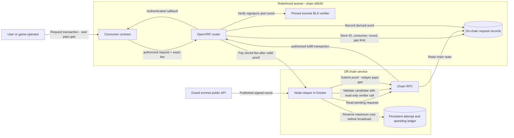
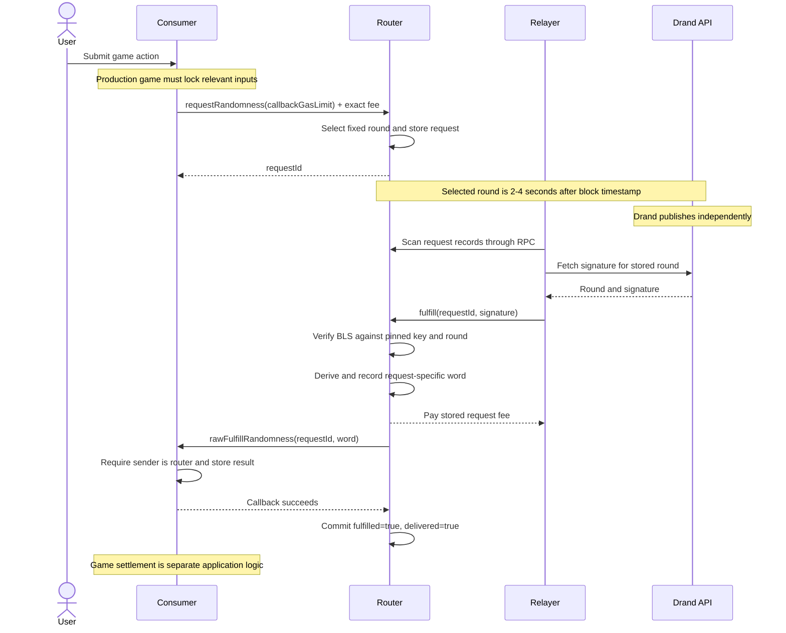

# Architecture and request lifecycle

This describes the current implementation, not proposed production hardening. It is a
drand-backed callback oracle, not a new randomness network or per-request secret VRF.
The included consumer is a minimal demonstration. The diagrams describe the source in this
repository, not a particular operator's deployment or game integration.

## Components and trust boundaries



- Drand runs independently. Our requests do not trigger beacon generation.
- The API transports a signature; the contract verifies it. An API is not trusted to choose a word.
- Under verifier assumptions, an authorized relayer cannot substitute a result, but can delay or
  stop delivery. Authorization prevents unauthorized third parties from racing the operator's gas
  transaction. The bundled relayer assigns request IDs round-robin across its configured wallet
  list and rotates unfinished work after a timeout. A shared PostgreSQL request lease prevents
  correctly configured wallets from submitting concurrently. This remains cooperative scheduling,
  not an on-chain restriction; an authorized wallet can bypass the service.
- The public key, beacon parameters and proof logic are fixed. The router is not upgradeable. Its
  owner controls consumer/relayer authorization, the request fee, and emergency withdrawals—not
  randomness. The first valid proof submission pays the stored fee directly to that authorized relayer;
  later callback retries cannot take it.
- RPC and sequencer behavior affect availability, ordering and timing. A valid proof does not establish
  that the game commitment was secure before the beacon became known.

## Successful request and callback



Proof recording and the first callback are in ONE fulfillment transaction. Nothing from that
transaction persists if the entire transaction reverts. The original request was made in an
earlier transaction and remains committed to its original round.

## Persistent request states

```mermaid
stateDiagram-v2
    [*] --> Pending: Request transaction succeeds
    Pending --> Pending: Too early, invalid proof or whole fulfillment reverts
    Pending --> Delivered: Valid proof and callback succeed
    Pending --> DeliveryPending: Valid proof; callback fails; outer transaction succeeds
    DeliveryPending --> DeliveryPending: Retry fails or retry transaction reverts
    DeliveryPending --> Delivered: Retry delivers the same stored word
    Delivered --> [*]
```



| State | fulfilled | delivered | Meaning |
|---|---|---|---|
| Pending | false | false | Original consumer and round fixed; no result committed |
| DeliveryPending | true | false | Result committed; callback still needs delivery |
| Delivered | true | true | Callback completed; duplicate delivery rejected |

`Delivered` is terminal for this request. No cancellation or redraw transition exists.
The implementation temporarily marks delivery before the external call and uses a delivery lock;
the diagram shows persisted states after transactions, not transient execution states.

## Result derivation

```text
beaconRandomness = sha256(signature)
randomWord = uint256(keccak256(abi.encode(
    beaconChainHash, beaconRandomness, chainId, routerAddress, requestId, consumerAddress
)))
```

All ingredients become public. Hashing adds request/domain separation, not secrecy after
beacon publication. The game must not permit outcome-dependent replacement of a commitment.

## Current relayer behavior

`relayer/main.mjs` validates chain ID, beacon hash, consumer authorization, relayer authorization
and configured addresses, then loads its local signer. WebSocket subscriptions deliver new blocks
and `RandomnessRequested` events without one-second HTTP polling. It also backfills event logs in
bounded block ranges at startup and every 15 seconds, using larger 100,000-block pages on startup
and persisting the next block before processing its pending set. Startup batches historical request
state reads through the canonical Multicall3 contract and retains failed subcalls for individual
verification. If Multicall3 is unavailable, the same individual checks remain authoritative. Each
reconciliation independently reads the current head over HTTP, so it recovers
events even if the WebSocket remains connected but silently stops advancing.

It skips completed requests and other consumers. For pending requests it fetches a signature;
for an already fulfilled request it retries the callback with a 50%-increased gas allowance,
capped at 1,000,000.
`START_BLOCK` begins historical event discovery and should be the router deployment block;
`START_REQUEST_ID` is an optional lower request-ID filter. Every 15 seconds, reconciliation scans
the previous 1,000-block window except the newest five blocks, which remain owned by the live
listener. Missed events enter reconciliation after aging beyond that lag. Discoveries are also
deduplicated by request ID and processed serially. PostgreSQL persists the cursor,
unfinished IDs, attempt counts, backoff, aggregate spending reservations, and the complete
pending-transaction recovery record; on-chain storage remains authoritative for randomness
and delivery. Completed per-request accounting is compacted into the lifetime spend total. Successful paid fulfillments renew
the operating allowance without erasing gross authorized-spend history.

HTTP errors, missing fields, incorrect round/length and rejection by full fulfillment gas estimation
trigger API fallback before a paid submission. This preflight relies on the configured RPC;
the actual transaction still verifies the signature on-chain.

The valid candidate’s full gas estimate is reused once for submission; the separate
proof-only simulation is omitted. Callback retries still estimate gas. Gas prices refresh
in the background every 30 seconds, retain 50% headroom over the greater of the RPC
quote and current base fee, and expire after 30 seconds. An unavailable or expired
cache requires a successful fresh query before spending. Pending fee recovery always
uses a fresh quote. The sender applies a gas-price ceiling and durably reserves the transaction's
maximum gas cost before broadcasting. Reservations are never refunded, including unused gas.
The per-request cap and renewable unreimbursed-operating cap apply alongside persisted attempt limits and exponential
backoff. A 60-second receipt timeout or ambiguous broadcast durably retains the signed bytes, hash,
nonce, and submission state. The process continues monitoring but blocks new spending from that
signer until reconciliation resolves the transaction. On startup and every 15 seconds, it checks
the receipt and mempool. If the transaction is absent and its nonce remains unused, it rebroadcasts
the identical signed bytes with persisted exponential backoff. A confirmation-safe consumed nonce
retires the impossible old transaction; an unexpected nonce gap or exhausted rebroadcast limit
enters persistent manual intervention and stops broadcasting without discarding recovery state.
RPC requests have a 15-second timeout and each drand endpoint has a 10-second timeout.
PostgreSQL advisory locking permits one process for each chain-and-signer scope, preventing the same
wallet from writing nonces concurrently through different router or consumer services. A shared,
versioned configuration record covers the algorithm, wallet ordering, failover, and lease intervals.
Request responsibility rotates after `RELAYER_FAILOVER_SECONDS` while unfinished IDs remain queued;
a renewable per-request lease protects any in-flight transaction across that boundary.
Persisted operational timestamps are Unix epoch milliseconds. PostgreSQL stores them as `BIGINT`;
the JSON ledger stores decimal strings so JavaScript never rounds large integer values. Chain and
drand timestamps remain Unix seconds because their protocol arithmetic is defined in seconds.

See [security status](security-status.md) and the [runbook](runbook.md).
For the unresolved commitment boundary, see [timing model and provider comparison](timing-model.md).
