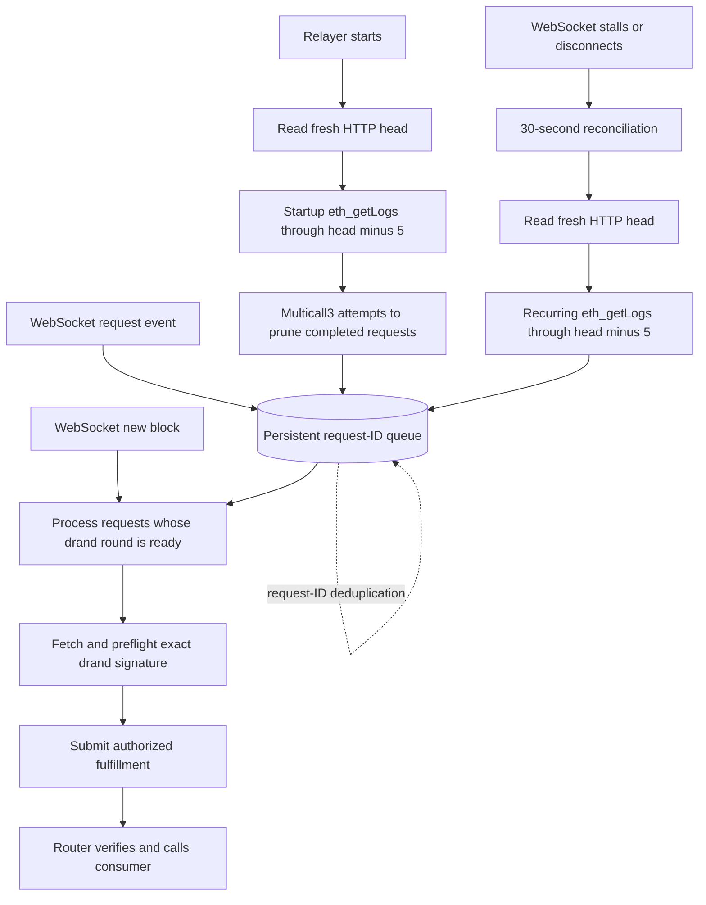

# Timing model in plain language

Think of a raffle: ticket sales must be firmly closed before the winning number becomes public.
Drand runs the draw on its own public schedule. It does not wait for our chain or relayer.

Our router chooses the first future draw, scheduled 1–3 seconds after the request block's timestamp.
This policy was selected for lower latency. It leaves less margin for timestamp staleness and
sequencer delay than the previous second-future-round policy (4–6 seconds). It does not
independently establish that the beacon was unknown when participation was committed.
The fast mode treats Robinhood Chain's sequencer ordering and timestamp as authoritative when the
request executes. This is the selected deployment trust model. A dishonest or abnormally stale
chain clock is outside that model, just as dishonest ordering would be for other contract actions.

For example, a block timestamp of 12:00:00 could select a draw between 12:00:04 and 12:00:06. We
need tickets locked before that draw, not merely a callback delivered afterwards. Waiting until
12:05 to deliver the result cannot undo its publication around 12:00:04–12:00:06.

[Robinhood documents](https://docs.robinhood.com/chain/) first-come-first-served sequencing and an
Arbitrum-based L2. Next-round selection deliberately uses that fast sequencer-confirmed view; it
does not wait for Ethereum finality. An application that requires Ethereum-finalized commitment
must use a slower policy and accept the corresponding callback latency.

The relayer reacts to WebSocket request and block events; it does not poll HTTP every second. On
startup and every 30 seconds, an independent HTTP reconciliation reads the current chain head and
backfills missed request events through five blocks behind it. Both discovery paths feed the same
ID-keyed persistent queue, so rediscovery does not create a second fulfillment.

Beacon publication, RPC calls, relayer work, serial receipt waits, and transaction inclusion add
latency. Approximately five-second delivery has worked in limited Robinhood testnet testing, but it
is not a deadline or SLA. Those observations validate the implementation, not all future sequencer
behavior, so the stated chain-timestamp trust assumption remains.

## How other providers handle the boundary

- **Chainlink:** request/fulfillment separation, request IDs and configurable block confirmations.
  Its security guide explicitly requires an appropriate confirmation depth for the chain and
  value at risk, frozen game inputs, and no cancellation or redraw. It warns that rewriting a
  request's block can reroll the result. A failing callback is not automatically retried; storing
  randomness before separate complex settlement is recommended.
  [Official security guide](https://docs.chain.link/vrf/v2-5/security).
- **ORAO:** the documented Solana callback product binds requests to unique per-client seeds;
  reuse is rejected. This is request-specific randomness, not a future public drand round.
  Its callback deadline allows fulfillment without a callback after repeated delivery trouble.
  That deadline is not a chain-finality wait, and seed uniqueness alone does not establish a
  finality policy. We have not established its operator confirmation policy from these docs.
  [Official callback SDK](https://github.com/orao-network/solana-vrf/tree/master/callback).
- **Gelato:** its documented design also selects a drand round and asynchronously delivers a
  callback. It therefore shares the scheduled-beacon commitment concern; using Gelato does not
  by itself prove that a chain's timing window is safe. These docs do not establish a safe
  Robinhood-specific margin or current service availability.
  [Official design](https://docs.gelato.cloud/vrf/introduction/how-gelato-vrf-works).

We selected the fast mode in source: trust Robinhood Chain's sequencing and timestamp, then use the
first future drand round. The router permanently binds that round and preserves the same result on retries.
Stronger Ethereum anchoring would be a different latency/security mode. How a consumer uses the
verified word is outside the oracle's control and must be reviewed by that application.
